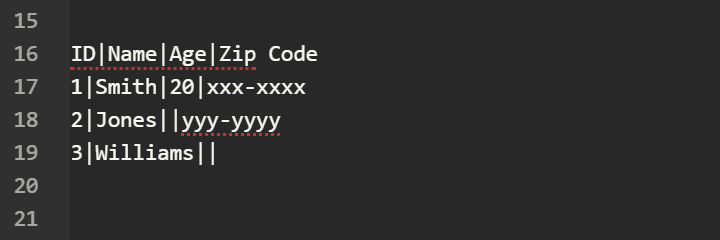

# MdTable

## Summary

MdTable is a tool to align a markdown table easily.

## How to use

1. Select 2 or more lines.
2. Press [Ctrl] + [Alt] + [t] keys.

## Sample

There is a not aligned markdown table in the below...

ID|Name|Age|Zip Code  
1|Smith|20|xxx-xxxx  
2|Jones||yyy-yyyy  
3|Williams||  

You can get the aligned table below by executing MdTable.

| ID       | Name     | Age      | Zip Code |
|:--------:|:--------:|:--------:|:--------:|
| 1        | Smith    | 20       | xxx-xxxx |
| 2        | Jones    |          | yyy-yyyy |
| 3        | Williams |          |          |

## URL

[GitHub](https://github.com/aumezawa/mdtable)
